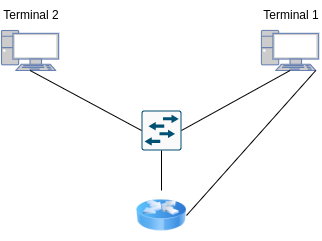
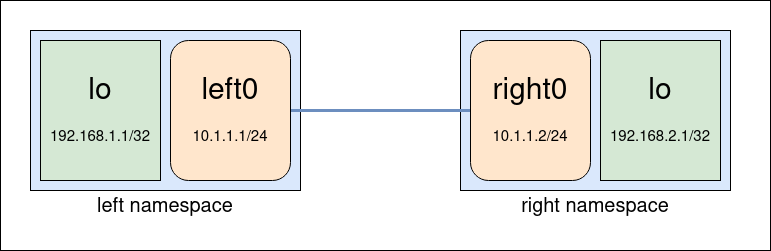

# Quality of Service Scheduling

## Tools Required

- **Traffic Generator**: generate traffic and analyses it for loss, jitter, .... E.g., **Cisco TRex**, **iperf**.

- **NetEm**: add delay, packet loss and more characteristics to a selected network interface. 
  
  - Note: Use the **linux realtime scheduler** (command line option --realtime or -z) and packet level timestamps for improved latency accuracy. 

- **Linux Traffic Control (tc)**: Traffic Control of the Linux kernel, used in this project change the traffic policing and shaping settings.
  
  - traffic policing: dropping or marking down non conforming packets.
  
  - traffic shaping: delaying traffic in excess to send it over in the next time intervals.
  
  - NOTE: https://tldp.org/HOWTO/Adv-Routing-HOWTO/lartc.adv-qdisc.ingress.html allows traffic control to outbound and **inbound** packets

- **Network Namespaces**: A Linux kernel feature allowing us to isolate network environments through virtualization. In this project we will use this feature to precisely compare the characteristics of different traffic policing and shaping settings (like jitter, ...).

## Scheme

 

### Terminals and router

- Uses **iperf** to generate/receive traffic.

- Uses **NetEM** to worsen the link's condition.

- Uses **tc** to test several schedulers and several traffic policing and shaping settings.

### Terminal 1

- Possesses two interfaces to the same network so it can measure specific time-dependent variables e.g., one-way delay.

### Terminal 2

- Responsible for generating cross-traffic (via **iperf**).

### Router

- May use specific schedulers that reserve resources (in order to ensure QoS to Terminal 1).

# Setup

Enable IP Forwarding (resets after reboot)

    echo 1 > /proc/sys/net/ipv4/ip_forward

Create and enable Python Env
    
    python -m venv env
    source env/bin/activate 

Install module

    pip install json2netns 

Source: https://github.com/cooperlees/json2netns

Create base network

    sudo json2netns base.json create

Open terminal into a custom namespace

    sudo ip netns exec right bash
    sudo ip netns exec left bash

Diagram of network

 

With a /32 prefix, there is no subnet or network, and all traffic to and from the device will go directly between the device and the default gateway.

# Generate traffic

Open terminal with right namespace

    # Needs to bind to loopback interface
    iperf3 -s -B 192.168.2.1

Open terminal with left namespace

    # Generate traffic at 100M/s
    iperf3 -c 192.168.2.1 -u -b 100M

# Limit connection bandwidth

To limit the rate of connection using the tc command, use the following syntax:

    tc qdisc add dev [INTERFACE] root tbf rate [RATE] burst [BURST] latency [LATENCY]

Where:

- [INTERFACE] is the name of the network interface you want to limit.
- [RATE] is the maximum rate of data transfer, in kilobits per second (Kbps) or megabits per second (Mbps).
- [BURST] is the maximum amount of data that can be sent at once, in kilobits or megabits.
- [LATENCY] is the amount of time it takes for the token bucket filter to refill, in milliseconds (ms).

For example, to limit the rate of connection on interface eth0 to 1 Mbps with a burst size of 10 Kbps and a latency of 100 ms, you would use the following command:

    tc qdisc add dev eth0 root tbf rate 1mbit burst 10kbit latency 100ms

This command needs to be applied on both **veth** interfaces in the respective namespaces.