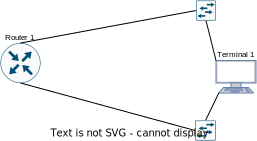
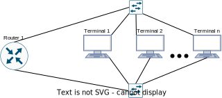

# Quality of Service Scheduling

## Tools Required

- **Traffic Generator**: generate traffic and analyses it for loss, jitter, .... E.g., **Cisco TRex**, **iperf**.

- **NetEm**: add delay, packet loss and more characteristics to a selected network interface. 
  
  - Note: Use the **linux realtime scheduler** (command line option --realtime or -z) and packet level timestamps for improved latency accuracy. 

- **Linux Traffic Control (tc)**: Traffic Control of the Linux kernel, used in this project change the traffic policing and shaping settings.
  
  - traffic policing: dropping or marking down non conforming packets.
  
  - traffic shaping: delaying traffic in excess to send it over in the next time intervals.
  
  - NOTE: https://tldp.org/HOWTO/Adv-Routing-HOWTO/lartc.adv-qdisc.ingress.html allows traffic control to outbound and **inbound** packets

- **Network Namespaces**: A Linux kernel feature allowing us to isolate network environments through virtualization. In this project we will use this feature to precisely compare the characteristics of different traffic policing and shaping settings (like jitter, ...).

## Topology

### Single Terminal topology

 

### Multi Terminal topology



### Terminals

- Each terminal possesses two network namespaces so it accurately can measure specific time-dependent variables e.g., one-way delay.

- Uses **iperf** to send traffic through one network namespace and receive it through another one.

### Router 1

- Uses **NetEM** to worsen the link between Router 1 and Router 2.

- Uses **tc** to test several schedulers.

- May use specific schedulers that reserve resources (in order to ensure QoS to the Terminals).

# Setup

## Virtual Namespaces
Create the 2 namespaces:
```bash
ip netns add v1s6
ip netns add v1s7
```

Add the interfaces to the network namespaces:
```bash 
ip link set dev enp1s6 netns v1s6
ip link set dev enp1s7 netns v1s7
```

Activate the interfaces and give them each an IP
```bash
ip netns exec v1s6 ip l set dev enp1s6 up 
ip netns exec v1s6 ip a add 192.168.20.2/24 dev enp1s6
ip netns exec v1s6 ip r add default via 192.168.20.1

ip netns exec v1s7 ip l set dev enp1s7 up 
ip netns exec v1s7 ip a add 192.168.10.2/24 dev enp1s7
ip netns exec v1s7 ip r add default via 192.168.10.1
```

## Linux Router
Enable IP Forwarding (resets after reboot)

    echo 1 > /proc/sys/net/ipv4/ip_forward

## Generate traffic via iperf3

Open terminal with right namespace

    # Needs to bind to loopback interface
    iperf3 -s -B 192.168.2.1

Open terminal with left namespace

    # Generate traffic at 100M/s
    iperf3 -c 192.168.2.1 -u -b 100M


## Emulate other connections via NetEm

Delay:
    
    sudo tc qdisc add dev eth2 root netem delay 100ms 10ms 25%
    
This causes the added delay to be 100ms ± 10ms with the next random element depending 25%
on the last one. This isn't true statistical correlation, but an approximation.

Packet Loss:

    sudo tc qdisc change dev eth2 root netem loss 5% 25%

This will cause 5% of packets to be lost, and each successive probability depends by a quarter
on the last one.
Prob(n) = .25 * Prob(n­1) + .75 * Random

Packet Corruption:

    sudo tc qdisc change dev eth2 root netem corrupt 5%

Random noise can be emulated with the corrupt option. This introduces a single bit error at a
random offset in the packet.

Packet Re­ordering:

    sudo tc qdisc change dev eth2 root netem delay 10ms reorder 25% 50%
    
In this example, 25% of packets (with a correlation of 50%) will get sent immediately, others will
be delayed by 10ms.

## Limit connection bandwidth

To limit the rate of connection using the tc command, use the following syntax:

    tc qdisc add dev [INTERFACE] root tbf rate [RATE] burst [BURST] latency [LATENCY]
Where:

- [INTERFACE] is the name of the network interface you want to limit.
- [RATE] is the maximum rate of data transfer, in kilobits per second (Kbps) or megabits per second (Mbps).
- [BURST] is the maximum amount of data that can be sent at once, in kilobits or megabits.
- [LATENCY] is the amount of time it takes for the token bucket filter to refill, in milliseconds (ms).

For example, to limit the rate of connection on interface eth0 to 1 Mbps with a burst size of 10 Kbps and a latency of 100 ms, you would use the following command:

    tc qdisc add dev eth0 root tbf rate 1mbit burst 10kbit latency 100ms

This command needs to be applied on both **veth** interfaces in the respective namespaces.